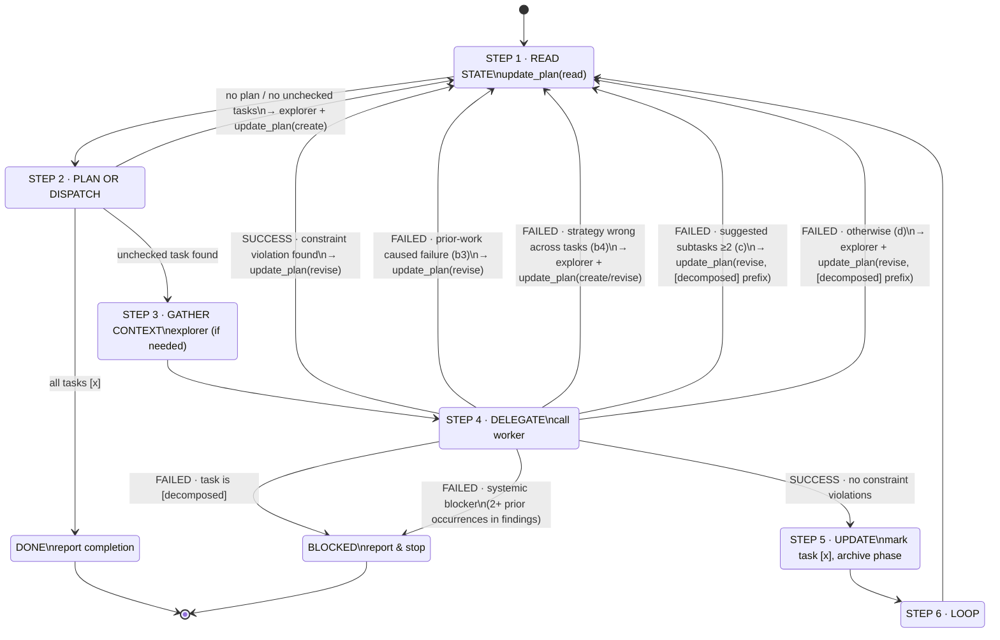

# Planner Agent — State Diagram

```mermaid
stateDiagram-v2
    [*] --> S1

    S1: STEP 1 · READ STATE\nupdate_plan(read)
    S2: STEP 2 · PLAN OR DISPATCH
    S3: STEP 3 · GATHER CONTEXT\nexplorer (if needed)
    S4: STEP 4 · DELEGATE\ncall worker
    S5: STEP 5 · UPDATE\nmark task [x], archive phase
    S6: STEP 6 · LOOP
    DONE: DONE\nreport completion
    BLOCKED: BLOCKED\nreport & stop

    S1 --> S2

    S2 --> S1      : no plan / no unchecked tasks\n→ explorer + update_plan(create)
    S2 --> DONE    : all tasks [x]
    S2 --> S3      : unchecked task found

    S3 --> S4

    S4 --> S5      : SUCCESS · no constraint violations
    S4 --> S1      : SUCCESS · constraint violation found\n→ update_plan(revise)

    S4 --> BLOCKED : FAILED · task is [decomposed]
    S4 --> BLOCKED : FAILED · systemic blocker\n(2+ prior occurrences in findings)
    S4 --> S1      : FAILED · prior-work caused failure (b3)\n→ update_plan(revise)
    S4 --> S1      : FAILED · strategy wrong across tasks (b4)\n→ explorer + update_plan(create/revise)
    S4 --> S1      : FAILED · suggested subtasks ≥2 (c)\n→ update_plan(revise, [decomposed] prefix)
    S4 --> S1      : FAILED · otherwise (d)\n→ explorer + update_plan(revise, [decomposed] prefix)

    S5 --> S6
    S6 --> S1

    DONE --> [*]
    BLOCKED --> [*]
```
