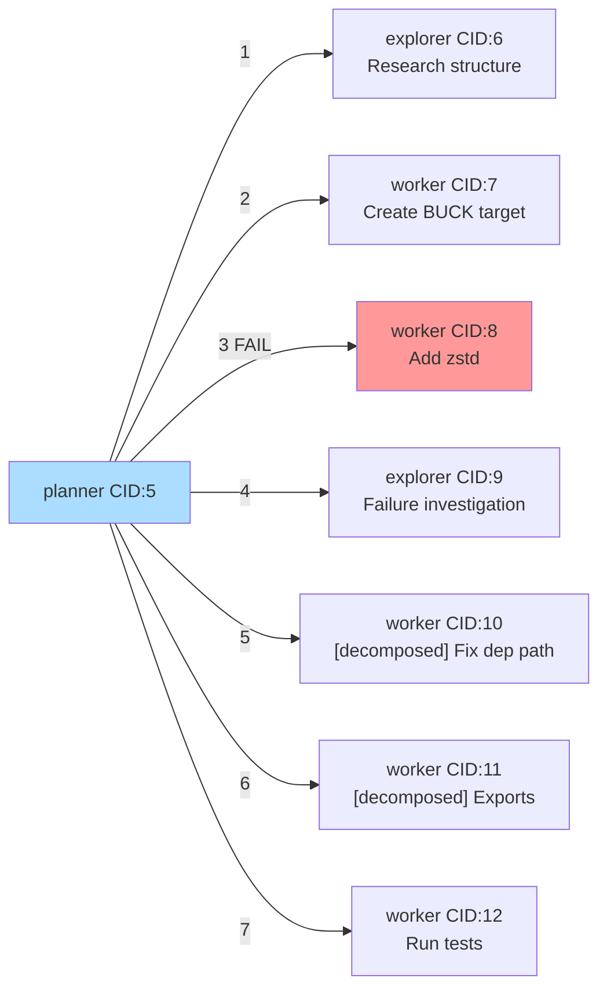

# Manus Run Visualization

## Goal

Visualize the exploration path manus takes each run — the sequence of explorer/worker spawns, their outcomes, and token costs — so runs can be compared side by side.

## Data Sources

Every manus run produces `cid-N-agentname.log` files in the working directory:

- **Orchestrators**: `cid-N-planner.log`, `cid-N-loop.log`
  Contain `=== TOOL CALL: worker ===` and `=== TOOL CALL: explorer ===` entries with `description` arguments — gives the spawn sequence and task descriptions.
- **Subagents**: `cid-N-worker.log`, `cid-N-explorer.log`
  Contain per-iteration token usage and final model response — gives metrics and outcome.

Log line format: `[unix_timestamp_seconds] message`

The `debug.log` (JSONL) is a richer secondary source but is not reliably present, so the plan does not depend on it.

## Parsing Strategy

From each log file, extract:

| Field | Source |
|---|---|
| `start_ts`, `end_ts` | First and last `[TIMESTAMP]` line |
| `total_tokens` | Last `Request total: prompt: X, completion: Y, total: Z` line |
| `iterations` | Count of `=== TOKEN USAGE ===` sections |
| `outcome` | Scan final model response for `SUCCESS:`, `FAILED:`, `BLOCKED:`, `✅` |

**Run grouping**: sort all orchestrator logs by `start_ts`. Run i spans CIDs `[cid_orch[i], cid_orch[i+1])`. Non-orchestrator logs whose CID falls in this range are children of that run.

**Spawn sequence**: parse the orchestrator log in order, extracting each `=== TOOL CALL: worker/explorer ===` block with its timestamp and `description` argument. Match to a child CID by finding the child log whose `start_ts` is closest after the spawn timestamp.

## Implementation

**File**: `apps/manus/visualize.py`
**Language**: Python stdlib only (`re`, `glob`, `datetime`, `sys`, `argparse`) — no dependencies.

### Core functions

```python
parse_log_file(path) -> LogInfo
# Returns: cid, agent_type, start_ts, end_ts, total_tokens, iterations, outcome

parse_spawn_calls(orchestrator_log_path) -> list[SpawnCall]
# Returns ordered list of (ts, tool_type, description) from TOOL CALL: worker/explorer blocks

group_into_runs(all_logs) -> list[Run]
# Each Run has: orchestrator LogInfo + ordered list of (SpawnCall, child LogInfo)

format_run_text(run) -> str
format_run_mermaid(run) -> str
format_compare_text(run_a, run_b) -> str
```

### CLI

```
python apps/manus/visualize.py [<dir>] [--run N] [--mermaid] [--compare N M]
```

- `<dir>` — working directory to scan (default: `.`)
- `--run N` — show only run N (1-indexed)
- `--mermaid` — output Mermaid diagrams instead of text tables
- `--compare N M` — print runs N and M side by side

## Output Formats

### Text (default)

```
Run #1  [CID 5..12]  started 2026-03-15 14:22  duration 8m 12s
Goal: Build zstd binary target in BUCK

  Step  Type      CID  Description                                   Outcome    Time    Tokens  Iters
  ─────────────────────────────────────────────────────────────────────────────────────────────────
  1     explorer  6    Research project structure, BUCK file, deps   OK         45s     8.2k    3
  2     worker    7    Create programs/BUCK zstd target               OK         2m 3s   15k     8
  3     worker    8    Add zstd to top-level BUCK                     FAIL       1m 10s  9k      6
  4     explorer  9    [failure] Investigate BUCK dependency format   OK         30s     5k      2
  5     worker    10   [decomposed] Fix BUCK dep path                 OK         1m      8k      5
  6     worker    11   [decomposed] Update module exports             OK         45s     6k      4
  7     worker    12   Run and verify tests                           OK         2m      7k      6

  Totals: 8m 12s  |  7 spawns  |  1 failure  |  1 decomposition  |  58.2k tokens
```

### Mermaid (`--mermaid`)



### Compare (`--compare N M`)

```
               Run 1 (8m 12s, 58k tok)                  Run 2 (4m 30s, 31k tok)
  Step 1:  explorer  Research structure     OK        explorer  Research structure     OK
  Step 2:  worker    Create BUCK target     OK        worker    Create BUCK target     OK
  Step 3:  worker    Add zstd top-level     FAIL      worker    Add zstd top-level     OK
  Step 4:  explorer  [failure] investigate  OK        worker    Run tests              OK
  Step 5:  worker    [decomposed] Fix path  OK
  Step 6:  worker    [decomposed] Exports   OK
  Step 7:  worker    Run tests              OK
```

## Verification

```bash
# Run against nanocode repo (has existing cid-10/11 logs)
cd /home/richard/dev/nanocode
python apps/manus/visualize.py .

# Mermaid output
python apps/manus/visualize.py . --mermaid

# Compare two runs
python apps/manus/visualize.py . --compare 1 2
```
